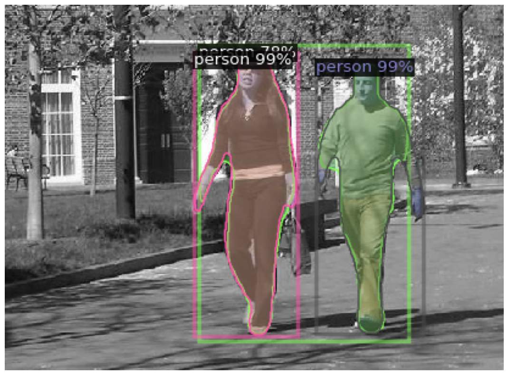

Here's the text file version of the README (save as `README.md`):

```
# PennFudanPed Instance Segmentation with Mask R-CNN

  
*Example of Mask R-CNN predictions on PennFudanPed dataset*

## Overview
This repository implements instance segmentation on the PennFudanPed dataset using Mask R-CNN with Detectron2. The solution provides:
- Object detection (bounding boxes)
- Instance segmentation (pixel-level masks)
- Evaluation metrics (COCO-style AP/AR)

## Key Features
- **Dataset Handling**: Custom data loader for PennFudanPed format
- **Model Architecture**: Mask R-CNN with ResNet-50-FPN backbone
- **Training**: Transfer learning from COCO pretrained weights
- **Evaluation**: COCO metrics (AP, AP50, AP75, etc.)
- **Visualization**: Side-by-side ground truth vs prediction comparisons

## Installation
```bash
# Install dependencies
pip install torch torchvision torchaudio
pip install git+https://github.com/facebookresearch/detectron2.git
pip install pyyaml==5.1 opencv-python

# Mount Google Drive (if using Colab)
from google.colab import drive
drive.mount('/content/drive')
```

## Dataset Preparation
1. Download dataset from [Penn-Fudan Database](https://www.cis.upenn.edu/~jshi/ped_html/)
2. Organize files:
```
PennFudanPed/
├── PNGImages/
│   ├── FudanPed00001.png
│   └── ... 
└── PedMasks/
    ├── FudanPed00001_mask.png
    └── ...
```

## Configuration
```python
cfg = get_cfg()
cfg.merge_from_file(model_zoo.get_config_file("COCO-InstanceSegmentation/mask_rcnn_R_50_FPN_3x.yaml"))
cfg.DATASETS.TRAIN = ("penn_fudan_train",)
cfg.MODEL.WEIGHTS = model_zoo.get_checkpoint_url("COCO-InstanceSegmentation/mask_rcnn_R_50_FPN_3x.yaml")
cfg.SOLVER.BASE_LR = 0.00025
cfg.SOLVER.MAX_ITER = 1000
cfg.MODEL.ROI_HEADS.NUM_CLASSES = 1
```

## Usage
### Training
```python
from detectron2.engine import DefaultTrainer

trainer = DefaultTrainer(cfg) 
trainer.resume_or_load(resume=False)
trainer.train()
```

### Evaluation
```python
from detectron2.evaluation import COCOEvaluator

evaluator = COCOEvaluator("penn_fudan_val", output_dir="./output")
val_loader = build_detection_test_loader(cfg, "penn_fudan_val")
print(inference_on_dataset(trainer.model, val_loader, evaluator))
```

### Inference
```python
from detectron2.utils.visualizer import Visualizer

im = cv2.imread("test_image.png")
outputs = predictor(im)
v = Visualizer(im[:, :, ::-1], metadata=metadata, scale=0.8)
out = v.draw_instance_predictions(outputs["instances"].to("cpu"))
cv2.imwrite("prediction.jpg", out.get_image()[:, :, ::-1])
```

## Results
Typical metrics after 1000 iterations:
```
Average Precision  (AP) @[ IoU=0.50:0.95 | area=   all | maxDets=100 ] = 0.745
Average Precision  (AP) @[ IoU=0.50      | area=   all | maxDets=100 ] = 0.892
```

## Common Issues
**CUDA Out of Memory:**
- Reduce batch size: `cfg.SOLVER.IMS_PER_BATCH = 1`
- Use smaller images: `cfg.INPUT.MIN_SIZE_TRAIN = (480, 640)`

**Dataset Loading Errors:**
- Verify image/mask filename alignment
- Check mask values (0 = background, 1-255 = instances)

## References
- [Detectron2 Documentation](https://detectron2.readthedocs.io/)
- [PennFudanPed Dataset Paper](https://arxiv.org/abs/1707.00084)

## License
MIT License - See [LICENSE](LICENSE) for details
```

To use this:
1. Copy all text
2. Save as `README.md`
3. Add appropriate images (update `sample_prediction.png`)
4. Commit to your GitHub repository

The markdown formatting will render properly on GitHub. For best results:
- Keep the code blocks intact
- Maintain the file structure hierarchy
- Use absolute paths for dataset references
- Update metrics with your actual results